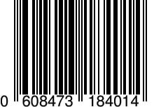
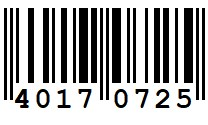
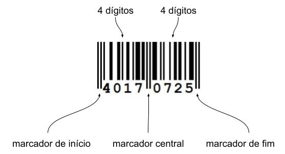
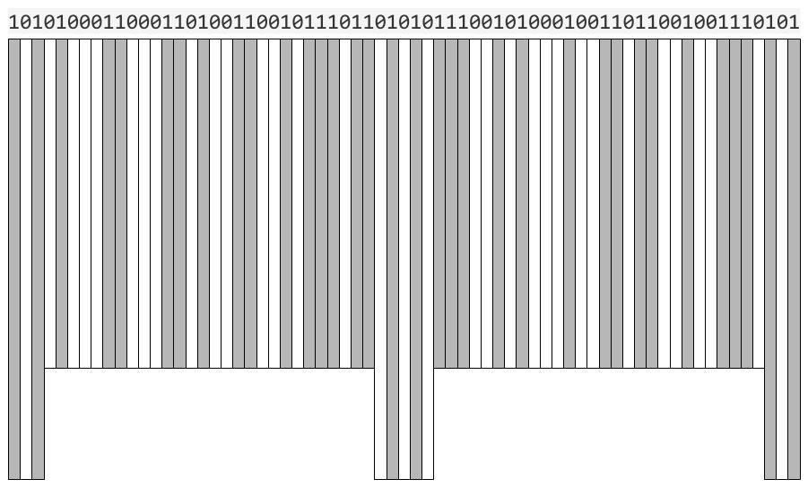
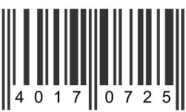
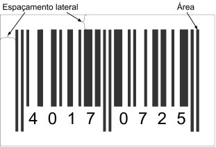

[](https://classroom.github.com/a/6YwtJirN)
# Código de barra - EAN-8

Códigos de barras, aqueles que encontramos em produtos de supermercados, boletos bancários, livros de bibliotecas, etiquetas do correio e tantas outras situações, são representações visuais de códigos usados para identificar e rastrear itens. Estas representações visuais em barras são muito populares porque são bem mais fáceis de serem interpretados por scanners do que usando imagens com letras e números.

Existem vários padrões de códigos. O mais usado aqui no Brasil é padrão GTIN-13, mais conhecido por sua denominação original EAN-13. Este é um padrão internacional que possui 13 dígitos codificados, dos quais 2 ou 3 são reservados para o país de origem do item, 9 ou 10 são reservados para o produto em si e 1 para um dígito verificador. A figura a seguir ilustra um código EAN-13.



O padrão EAN-13 não é entretanto adequado para pequenos itens, cujo tamanho impede que uma etiqueta com tantas barras seja utilizada. Para esses itens, uma variação denominada EAN-8 possuindo apenas 8 dígitos foi criada. A figura a seguir ilustra um código EAN-8.



Neste padrão, 2 ou 3 dígitos são também reservados para o país de origem, restando portanto apenas 4 ou 5 para o produto em si, uma vez que ele também tem um dígito verificador.

Esse padrão é bastante utilizado por mercadinhos e pequenas lojas que precisam de um código de barra apenas automatizar seus PDV (pontos de venda). Nesse caso, eles não fazem uso do código do país, aproveitando todos os 7 dígitos de informação para geranciamento interno de seus itens. Este será o caso do nosso projeto.

O presente projeto tem como objetivo desenvolver 2 programas: um para gerar uma imagem com um código de barra EAN-8 a partir de um dado identificador, e outro para extrair o identificador de uma imagem com um código de barra EAN-8. Ambos os programas devem lidar com imagens no formato PBM.

As descrições tanto do padrão EAN-8 quanto do formato PBM são apresentadas a seguir.

## Padrão EAN-8

O padrão EAN-8 possui 7 dígitos com informações úteis e 1 dígito adicional para verificar se o código de barra foi escaneado corretamente.

### Dígito verificador

O último dígito do identificador é usado como dígito verificador. Um cálculo é feito usando os 7 primeiros dígitos e se o resultado desse cálculo não corresponder com o dígito verificador é porque houve algum erro na leitura realizada pelo scanner... e uma nova tentativa deve ser feita.

O cálculo no padrão EAN-8 é feito a partir de uma soma ponderada dos dígitos, como descrito a seguir:

1. Calcula-se a soma ponderada dos 7 primeiros dígitos, usando o peso 3 para os dígitos de índice ímpar e o peso 1 para os de índice par.
1. Com o valor da soma, calcula-se quanto falta para o próximo múltiplo de 10. O resultado será o dígito verificador.

Por exemplo, digamos que os 7 primeiros dígitos do código sejam 4017072. Logo, 4 encontra-se no 1º índice, 0 no 2º índice, 1 no 3º, 7 no 4º... e assim por diante. A soma ponderada será portanto calculada através de expressão abaixo:

$$
soma = (3 \times 4) + (1 \times 0) + (3 \times 1) + (1 \times 7) + (3 \times 0) + (1 \times 7) + (3 \times 2)
$$

$$
soma = 12 + 0 + 3 + 7 + 0 + 7 + 6
$$

$$
soma = 35
$$

O próximo múltiplo é $40$. Logo, o dígito verificador será $40 - 35 = 5$. Se o 8º dígito do código não for $5$, então houve um erro na leitura do código.

### Codificação das barras

A codificação dos dígitos em barras é demarcada por **áreas**, também chamado de módulos, de tamanhos iguais. Dentre essas áreas, há algumas reservadas para servirem como marcadores de início, central e de fim do código, a fim de facilitar sua identificação. Assim, o código consiste em:

- 3 áreas para o marcador de início;
- 28 áreas para codificar os 4 primeiros dígitos (7 áreas por dígito);
- 5 áreas para o marcador central;
- 28 áreas para codificar os 4 primeiros dígitos (7 áreas por dígito);
- 3 áreas para o marcador de fim.

Os marcadores de início e fim possuem 3 áreas contendo barras equivalentes à sequência `101`, onde `1` representa o preenchimento da área (barra) e `0` o não preenchimento (espaço em branco). O marcador central possui 5 áreas contendo barras equivalentes a `01010`. Por exemplo, o código de barra abaixo indica bem os marcadores de início, de fim e o central, além das barras dos dígitos.



Para codificar os dígitos, o padrão EAN-8 utiliza duas codificações: uma para os 4 dígitos iniciais, chamada de L-code, e outra para os 4 dígitos finais, chamada de R-code. A tabela abaixo apresenta a codificação de cada dígito nas duas formas. Novamente, os valores `1` representam o preenchimento das respectivas áreas (barra) e `0` o não preenchimento (espaço em branco).

| Dígito | L-code  | R-code  |
|--------|---------|---------|
| 0      | 0001101 | 1110010 |
| 1      | 0011001 | 1100110 |
| 2      | 0010011 | 1101100 |
| 3      | 0111101 | 1000010 |
| 4      | 0100011 | 1011100 |
| 5      | 0110001 | 1001110 |
| 6      | 0101111 | 1010000 |
| 7      | 0111011 | 1000100 |
| 8      | 0110111 | 1001000 |
| 9      | 0001011 | 1110100 |

### Exemplo de codificação

Digamos que queremos criar o código de barra para o número 40170725. Os 4 primeiros dígitos, 4017, serão representados pelo L-code:

| Dígito | L-code  |
|--------|---------|
| 4      | 0100011 |
| 0      | 0001101 |
| 1      | 0011001 |
| 7      | 0111011 |

... e 4 dígitos seguintes, 0725, serão representados pelo R-code:

| Dígito | R-code  |
|--------|---------|
| 0      | 1110010 |
| 7      | 1000100 |
| 2      | 1101100 |
| 5      | 1001110 |

Assim, os 8 dígitos serão representados por:

- Marcador inicial: `101`
- Dígitos iniciais: `0100011 0001101 0011001 0111011`
- Marcador central: `01010`
- Dígitos finais: `1110010 1000100 1101100 1001110`
- Marcador final: `101`

A representação final contendo barras e espaços será portanto a junção de todas essas áreas, ficando assim:
```
1010100011000110100110010111011010101110010100010011011001001110101
```

A figura abaixo realça as áreas preenchidas e os espaços em branco do código 40170725.







## Formato de imagem PBM

O formato de imagem PBM faz parte de um pacote de formatos definidos no Linux por um projeto chamado NetPBM. Nele, foram estabelecidos vários formatos simples de imagens, como o PPM, o PGM e o PBM. Este último, acrônimo de *Portable Bitmap Format*, é utilizado para definir imagens com apenas duas cores: preto e branco, sendo portanto ideal para representar nossos códigos de barra.

Há duas versões do formato PBM, uma em formato ASCII e outra em binário. Neste projeto, iremos trabalhar com a primeira forma, na qual cada pixel é representado por um dos seguintes caracteres:
- `1`: caso o pixel seja preto, ou;
- `0`: caso o pixel seja branco.

Assim, a imagem é representado por uma matriz de `1`s e `0`s, indicando onde o pixel é preto e onde é branco.

A matriz é precedida de um cabeçalho com duas linhas. A primeira contém obrigatoriamente a string `P1` e a segunda contém o tamanho da imagem, mais especificamente a largura e a altura da imagem.

Um exemplo de imagem PBM de tamanho 7 x 10 com a letra J é apresentada a seguir. 

```
P1
7 10
0 0 0 0 0 0 0
0 0 0 0 0 1 0
0 0 0 0 0 1 0
0 0 0 0 0 1 0
0 0 0 0 0 1 0
0 0 0 0 0 1 0
0 0 0 0 0 1 0
0 1 0 0 0 1 0
0 0 1 1 1 0 0
0 0 0 0 0 0 0
```

Apesar do espaços em branco e saltos de linhas entre os `0`s e `1`s no arquivo acima, esses espaços não são obrigatórios. O conteúdo abaixo continuaria sendo uma imagem PBM válida, representando o mesmo J.

```
P1
7 10
0000000000001000000100000010000001000000100000010010001000111000000000
```


### Código de barra no PBM 

Para criar uma imagem com um código de barra, precisamos estabelecer inicialmente um espaçamento lateral para que o código não fique no limite da imagem. Depois disso, inserimos a sequência de `0`s e `1`s de suas áreas, considerando a largura fixa de cada área do código.

Como dito anteriormente, cada área possui uma largura de tamanho fixo. Assim, se cada área ocupar $3$ pixels de largura, o código de barra terá uma largura total de $(3 + 28 + 5 + 28 + 3) \times 3 = 67 \times 3 = 201$ pixels. Se uma área ocupar $4$ pixels, o código terá $67 \times 4 = 268$ pixels. Se for $5$, será $67 \times 5 = 335$, e assim por diante. A altura do código pode ser variável e se adequar à largura, de forma que facilite a leitura por um scanner.

Para exemplificar, vamos considerar apenas a representação do marcador inicial `101` em uma imagem PBM. Os demais valores, inclusive linhas omitidas, serão representados neste exemplo por `...`.

Considerando uma imagem gerada com um espaçamento lateral de 4 pixels, com a largura de cada área do código de 3 pixels e altura de 50 pixels, teremos o seguinte arquivo:
```
P1
209 58
0000000000000...
0000000000000...
0000000000000...
0000000000000...
0000111000111...
0000111000111...
0000111000111...
0000111000111...
...
0000111000111...
0000111000111...
0000111000111...
0000111000111...
0000000000000...
0000000000000...
0000000000000...
0000000000000...
```



A imagem terá uma largura de 209 pixels porque serão 201 para o código de barra mais 4 de espaçamento em cada lado. Da mesma forma, ela terá uma altura de 58 pixels devido aos 50 da altura do código mais 4 de espaçamento em cima e embaixo.

## Programas a serem desenvolvidos

No presente projeto, você deve desenvolver dois programas: um para gerar uma imagem com um código de barra no padrão EAN-8 representando um dado identificador, e outro para extrair o identificador representado em uma imagem com um código de barra no padrão EAN-8. Os dois programas devem fazer uso de um "código compartilhado", útil a ambos os programas.

Como são dois programas diferentes, com código compartilhado entre eles, seu projeto deverá ter pelo menos:

- um arquivo .cpp com a função main() do programa para gerar a imagem com o código de barra;
- um arquivo .cpp com a função main() do programa para extrair o identificador do código de barra;
- um ou mais arquivos .cpp com classes, struct e funções para manipulação das imagens, de valores ou qualquer outra funcionalidade compartilhada pelos 2 programas.

Além disso, com a função main() em arquivos diferentes, a compilação de cada um dos programas (codificação e decodificação) deve ser feita de forma separada.

### Geração do código de barras

O programa que gera a imagem PBM deve adotar o seguinte funcionamento:

- O programa deve receber como argumento obrigatório (**em linha de comando**) o identificador a ser inserido no código de barra.
- Haverá também os seguintes argumentos opcionais (**em linha de comando**):
  - O espaçamento lateral do código na imagem (em pixels);
  - A quantidade de pixels por área do código (em pixels);
  - A altura do código de barra (em pixels);
  - O nome da imagem PBM a ser gerada.
- Caso o usuário não informe os argumentos opcionais, o programa adotará um valor padrão pré-definido.
- Se o identificador a ser inserido não for um identificador válido, o programa deve informar o problema e parar a execução. Possíveis problemas são:
  - Identificador contém valores não numéricos;
  - Identificador não possui 8 dígitos;
  - O digito verificador do identificador é inválido (não corresponde aos valores anteriores).
- Se o arquivo da imagem a ser gerada já existir, o programa deverá informar que o arquivo já existe e perguntar se poderá sobreescrevê-lo. Se o usuário informar que "não", o programa deverá mostrar uma mensagem de erro ("arquivo resultante já existe") e parar a execução.
- Caso não haja erro, o programa deverá gerar a imagem PBM com o código de barras.

### Extração do identificador do código de barras

O programa que extrai o identificador do código de barras presente numa imagem PBM deve adotar o seguinte fucionamento:

- O programa deve receber como argumento obrigatório (**em linha de comando**) apenas o nome do arquivo da imagem PBM com o código de barras;
- Se o arquivo não existir, ou se existir e não for um arquivo PBM válido, o programa deve informar que o arquivo é inválido e parar a execução;
- Caso seja um arquivo PBM válido, o programa deve verificar se há um código de barras na imagem. Se não houver, o programa deverá informar que o código não foi encontrado.
- Caso não haja erro, o programa deverá extrair o identificador presente no código de barra e enviá-lo para a saída padrão.

## Critérios de correção

**Funcionalidades**: 6,0 pontos
- Argumentos em linha de comando
  - os programas consideram argumentos passados na linha de comando?
  - se argumentos não forem passados, valores padrões serão utilizados?
- Geração do código de barra
  - o dígito verificador é validado?
  - o identificador é codificado corretamente?
  - a codificação é transformada em imagem de forma adequada?
  - o arquivo de imagem é gerado com o código de barras correto?
- Extração do identificador
  - o arquivo de imagem é lido corretamente?
  - o programa consegue verificar se há um código de barras na imagem?
  - Foi possível calcular o número de pixels definir uma área do código (largura da área)?
  - o programa conseguiu extrair o identificador?

**Código desenvolvido**: 4,0 pontos
- Classes
  - classes são especificadas usando os arquivos .h e .cpp adequadamente?
  - nas classes, há atributos e métodos, alguns privados outros públicos?
- Alocação dinâmica
  - utilizou-se alocação dinâmica de forma adequada?
  - tomou-se cuidado para desalocar o que não era mais útil?
- Organização e documentação
  - o código foi devidamente documentado (seguindo o modelo de documentação apresentado)?
  - o código segue um padrão de identação, nomenclatura e organização?

**Pontos adicionais**: até 2,0 pontos

- Inserção dos dígitos na imagem abaixo do código;
- Uso do formato PBM no modo binário (P4);
- Uso de interfaces gráficas (bibliotecas de interface);
- entre outros...